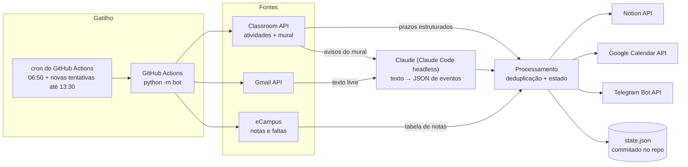

# Assistente Acadêmico 🎓

Um bot que roda sozinho todo dia às 7h, lê tudo o que chega da faculdade (Google Classroom, e-mails
e o portal acadêmico eCampus/UFAM), entende avisos escritos em linguagem natural com IA e organiza a
agenda no **Notion**, no **Google Calendar** e no **Telegram**.

> Problema real que ele resolve: professores nem sempre cadastram provas e prazos como "atividade" no
> Classroom. Muitas vezes é só um aviso no mural ("na próxima segunda será nossa primeira prova") ou um
> e-mail do representante às 6h da manhã ("hoje não haverá aula"). Isso se perde fácil.

**Custo de operação: R$ 0** — roda no GitHub Actions (plano gratuito) e usa a assinatura Claude Pro já existente.

---

## O que ele faz

| Fonte | O que lê | Como |
|---|---|---|
| Google Classroom (2 contas) | Atividades com prazo **e** avisos escritos no mural | API oficial (OAuth, somente leitura) |
| Gmail (pessoal + institucional) | E-mails de professores, representante, reitoria | API oficial (OAuth, somente leitura) |
| eCampus (portal da UFAM) | Notas parciais e faltas por disciplina | Login + endpoint interno da página |

| Destino | O que recebe |
|---|---|
| **Notion** | Banco "Avaliações e Notas", banco "Disciplinas" (média, faltas, limite de faltas) e página "Minha Semana" |
| **Google Calendar** | Um evento para cada prova, entrega, demanda e aula cancelada, com lembrete de 1 dia |
| **Telegram** | Resumo diário às 7h |

Exemplo do resumo diário:

```
🌅 Bom dia! Quinta, 08/10

⚠️ Atenção
❌ Sem aula de Comunicações Digitais — Quinta 08/10
    Motivo: Professor em banca de defesa
    Avisado pelo representante da turma.
🏛️❌ UFAM sem atividades presenciais — de Ter 13/10 a Qua 14/10
    Motivo: Baixa qualidade do ar causada pelas queimadas

📚 Aulas hoje
  08:00–10:00 Comunicações Digitais  ❌ cancelada (Professor em banca de defesa)
  10:00–12:00 Libras

📅 Provas e trabalhos da semana
  🎤 Sex 09/10 13:59 — 2ª avaliação do projeto (Arquitetura) ⚠️ amanhã

🆕 Novidades
📎 Trabalho em grupo sobre Weber — Quarta 21/10
📊 Arquitetura: nota nova! média 8.50 (E1 8.50)
```

---

## Arquitetura



### Decisões técnicas

- **IA só onde precisa.** Atividades do Classroom e a tabela do eCampus são dados estruturados e são
  processados direto em Python. O modelo de linguagem só é chamado para **texto livre** (e-mails e avisos
  do mural), numa única chamada por dia com todos os itens novos. Isso reduz custo e erro.
- **Saída estruturada.** O prompt envia a grade de horários, as disciplinas (com apelidos) e a data de
  recebimento de cada item, e pede um JSON com `tipo`, `disciplina`, `data`, `data_fim`, `motivo` e
  `abrangencia` (uma disciplina ou a universidade toda). Datas relativas ("quinta que vem") são
  resolvidas a partir da data do e-mail, não da execução.
- **Claude sem custo extra.** Em vez da API paga, o bot roda o Claude Code em modo não interativo
  (`claude -p --output-format json`) autenticado com um token OAuth da assinatura Pro
  (`claude setup-token`), guardado como secret.
- **Degradação graciosa.** Se o Claude estiver indisponível (ex.: limite de uso), um filtro por
  expressões regulares ainda detecta o urgente ("não haverá aula", "greve", "paralisação") e avisa às 7h;
  o dia fica marcado como pendente e o cron tenta de novo a cada hora, sem perder nenhum e-mail
  (a janela de leitura só avança após uma execução completa).
- **Idempotência.** Cada item tem um `ID externo` (`atividade:<curso>:<id>`, `email:<conta>:<id>`...)
  gravado no Notion; eventos do Calendar são mapeados no `state.json`. Rodar duas vezes não duplica nada.
  Se o professor muda o prazo no Classroom, só a data é atualizada — títulos e anotações editados à mão
  no Notion são preservados.
- **Estado sem banco de dados.** O `state.json` (o que já foi visto, últimas notas, mapeamento de eventos)
  é commitado de volta no próprio repositório ao fim de cada execução. Um `concurrency group` impede
  duas execuções simultâneas.
- **Falhas isoladas.** Cada fonte roda em um bloco próprio: se o eCampus sair do ar, Gmail e Classroom
  continuam e o problema aparece no resumo do Telegram.
- **Primeira execução silenciosa.** Na primeira vez, tudo o que já existe é importado sem gerar
  "novidades", para o Telegram não receber dezenas de mensagens.
- **Fuso horário explícito.** Prazos do Classroom vêm em UTC e são convertidos para America/Manaus.
- **Engenharia reversa leve do eCampus.** A página de notas carrega a tabela via AJAX
  (`POST notasEFrequencia/getNotas` com ano e período); o bot chama esse endpoint direto e converte a
  tabela HTML em linhas, detectando notas ainda não lançadas.

### Segurança e privacidade

- Escopos OAuth mínimos: Gmail e Classroom **somente leitura**; no Calendar, só eventos.
- Nenhuma senha ou token no código: tudo em **GitHub Secrets** (`.env` local fica no `.gitignore`).
- Os scripts de configuração leem tokens com `getpass` e enviam secrets via stdin — nada aparece na tela
  nem no histórico do terminal.
- [Política de privacidade](https://samymallmann.github.io/assistente-academico/)

---

## Estrutura

```
bot/
  __main__.py          orquestração: coleta → interpreta → grava → resume
  claude.py            prompt + chamada ao Claude Code (headless)
  palavras_chave.py    plano B por regex quando a IA está indisponível
  google_api.py        OAuth com refresh token por conta
  fontes/
    classroom.py       atividades (prazos) e avisos do mural
    gmail.py           e-mails novos desde a última execução
    ecampus.py         login e tabela de notas/faltas
  destinos/
    notion.py          avaliações, notas e consultas para o resumo
    calendario.py      criação/atualização idempotente de eventos
    telegram.py        envio do resumo (HTML)
scripts/
  autorizar_google.py  fluxo OAuth local (loopback) para gerar o refresh token
  configurar_telegram.py  descobre o chat_id e testa o bot
  salvar_segredo.py    guarda tokens no .env sem mostrar na tela
  enviar_secrets.py    envia o .env para os GitHub Secrets
config.example.json    disciplinas, grade, filtros de e-mail e IDs do Notion
.github/workflows/bot.yml
```

## Como usar no seu próprio semestre

1. Faça um fork **privado** e copie `config.example.json` para `config.json` com as suas disciplinas
   (no fork privado, remova `config.json` e `state.json` do `.gitignore`).
2. Crie um app OAuth "App para computador" no Google Cloud (Gmail, Classroom e Calendar APIs) e rode
   `python scripts/autorizar_google.py pessoal` (e `ufam`, se tiver conta institucional).
3. Crie um bot no @BotFather e rode `python scripts/configurar_telegram.py`.
4. Rode `claude setup-token` e `python scripts/salvar_segredo.py CLAUDE_CODE_OAUTH_TOKEN`.
5. Crie uma integração interna no Notion, conecte à sua página e salve o `NOTION_TOKEN`.
6. `python scripts/enviar_secrets.py`, cadastre `ECAMPUS_USUARIO`/`ECAMPUS_SENHA` e crie a variável
   de repositório `BOT_ATIVO = true`.
7. Teste localmente com `python -m bot --teste` (não grava nada e imprime a mensagem).

## Stack

Python 3.12 · `requests` · Google Classroom / Gmail / Calendar APIs · Notion API · Telegram Bot API ·
Claude Code · GitHub Actions
